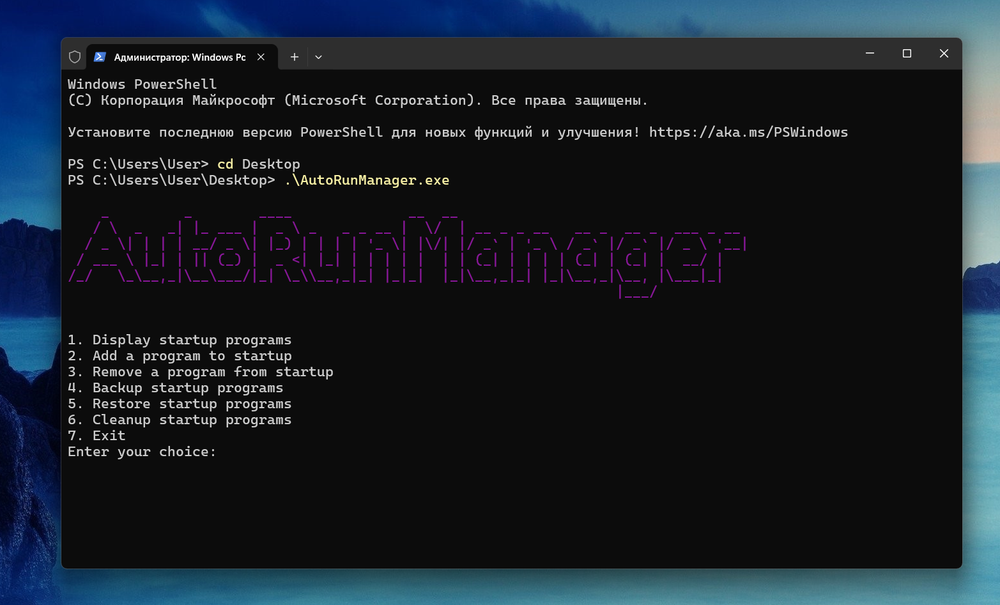

# AutoRunManager


AutoRun Manager is a utility for managing the programs that run at startup on a Windows system. It provides a simple interface for adding, removing, and viewing startup programs. Additionally, it includes features for backing up and restoring your startup configuration.

# Features
- Display Startup Programs: List all programs that are currently set to run at startup.
- Add Startup Program: Add a new program to the startup list.
- Remove Startup Program: Remove a program from the startup list.
- Backup Startup Programs: Create a backup of the current startup configuration.
- Restore Startup Programs: Restore the startup configuration from a backup.
- Cleanup Startup Programs: Remove all programs from the startup list.

# Notes
- The program interacts with the Windows Registry to manage startup programs. Please use it with caution.
- The backup and restore features do not backup or restore the actual programs, only the startup configuration.
- All actions and errors are logged to a text file located in the `My Documents\AutoRunManager` directory. Each log file is named with a timestamp to ensure unique filenames.

## Usage

1. Open a command prompt as administrator.
2. Navigate to the directory containing the utility.
3. Run the utility as a command-line argument. For example:

    ```
    .\AutoRunManager.exe
    ```
4. When you start the application, you'll see a title and an available commands.

## Contributions

We welcome contributions from the community. If you have a command you'd like to add, feel free to open a pull request.

## Author

Bohdan Harabadzhyu

## License

[MIT](https://choosealicense.com/licenses/mit/)

